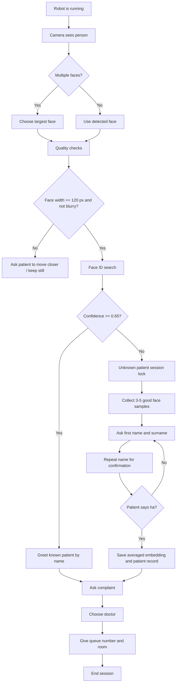

# Face ID Hospital Robot Flow

## Core Rules

- Pick the largest detected face when multiple people are visible. This is treated as the nearest patient.
- Draw face boxes on screen; highlight the selected face.
- Do not register from one frame. Collect at least 3 good face samples.
- Reject registration samples when face width is under 120 px.
- Reject blurry samples.
- Keep a session lock while one patient is being greeted or registered.
- Ask for first name and surname.
- Repeat the detected name back to the patient.
- Register only after the patient confirms with "ha".
- Treat Face ID confidence below 0.65 as unknown.
- Store embeddings for recognition. Keep one patient image only for the admin Patients page.
- Admin can add, edit, delete, and attach/replace patient face images.

## Flow

## Robot Scripts

Yangi bemor:
"Assalomu alaykum. Sizni birinchi marta ko'ryapman. Iltimos, ism va familiyangizni ayting."

Tasdiqlash:
"Sizning ism-familiyangiz Solijonov Abduxoliqmi? To'g'ri bo'lsa ha, noto'g'ri bo'lsa yo'q deng."

Ro'yxatdan o'tdi:
"Rahmat, siz ro'yxatdan o'tdingiz. Endi qanday shikoyatingiz bor?"

Tanilgan bemor:
"Assalomu alaykum, Abduxoliq aka. Bugun qanday shikoyat bilan keldingiz?"

Yo'naltirish:
"Siz terapevt shifokoriga yo'naltirildingiz. Sizning navbatingiz: 5. Xona: 204. Iltimos, kutish zalida navbatingizni kuting."

Xavfli holat:
"Sizda shoshilinch holat belgisi bo'lishi mumkin. Iltimos, darhol navbatchi shifokorga murojaat qiling. Men xodimni chaqiryapman."
